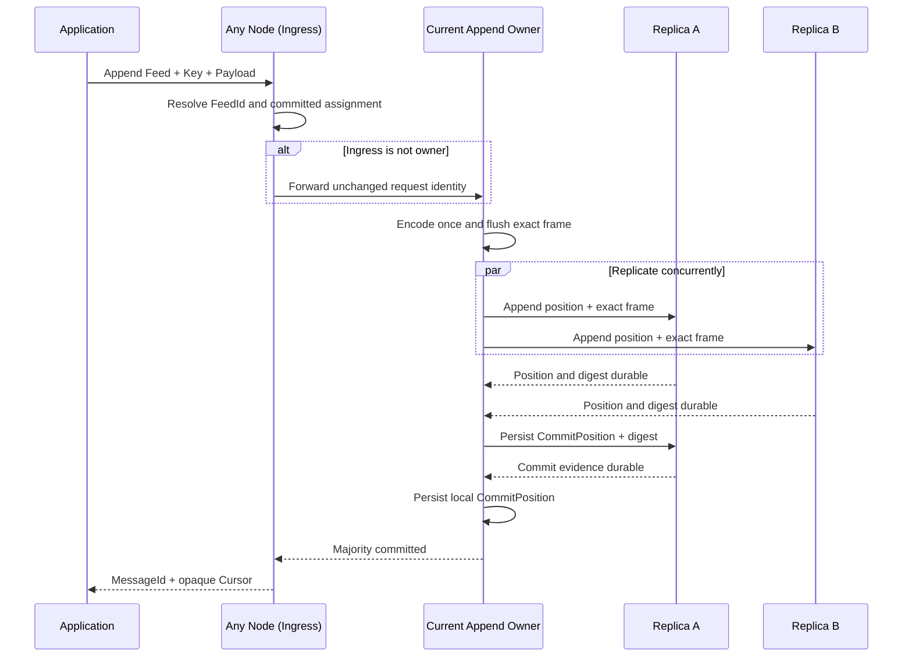
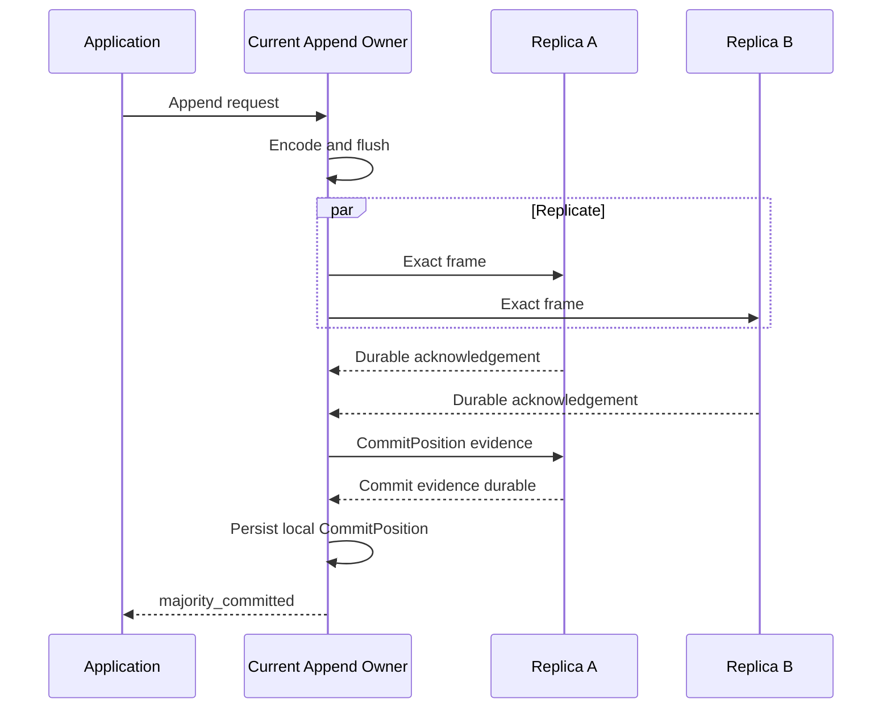
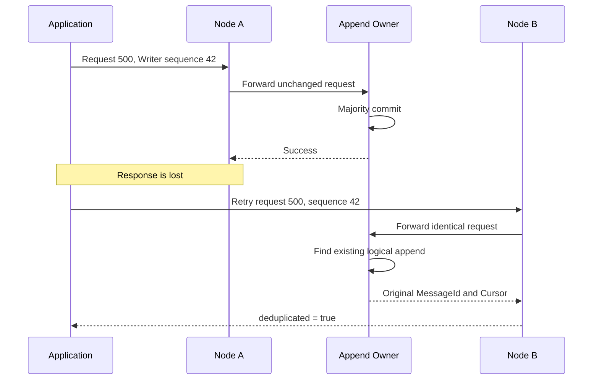
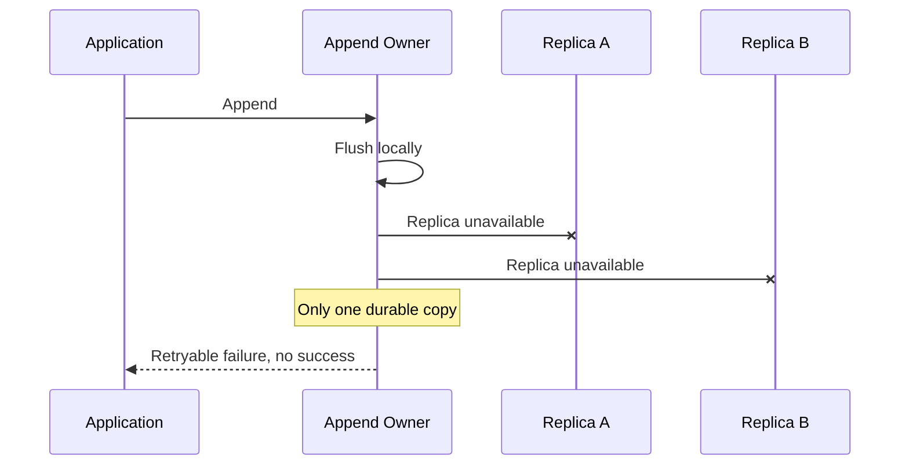
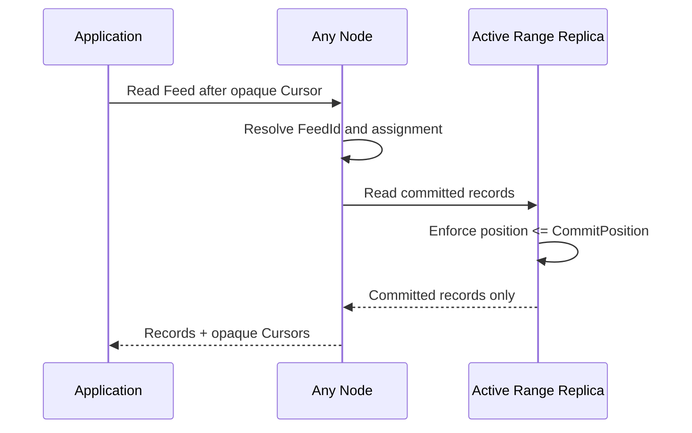
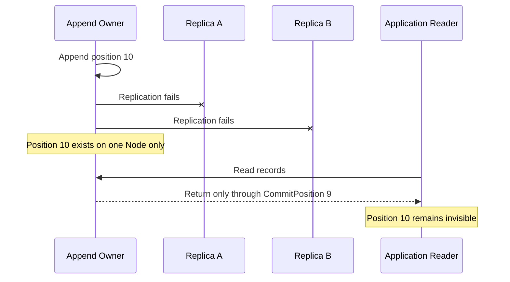
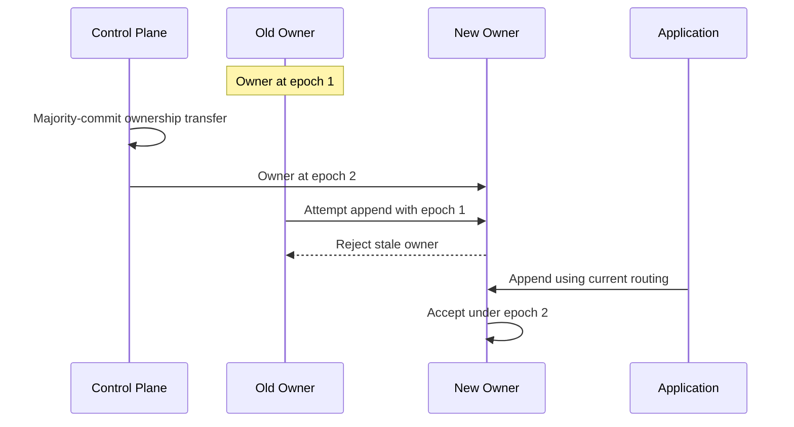
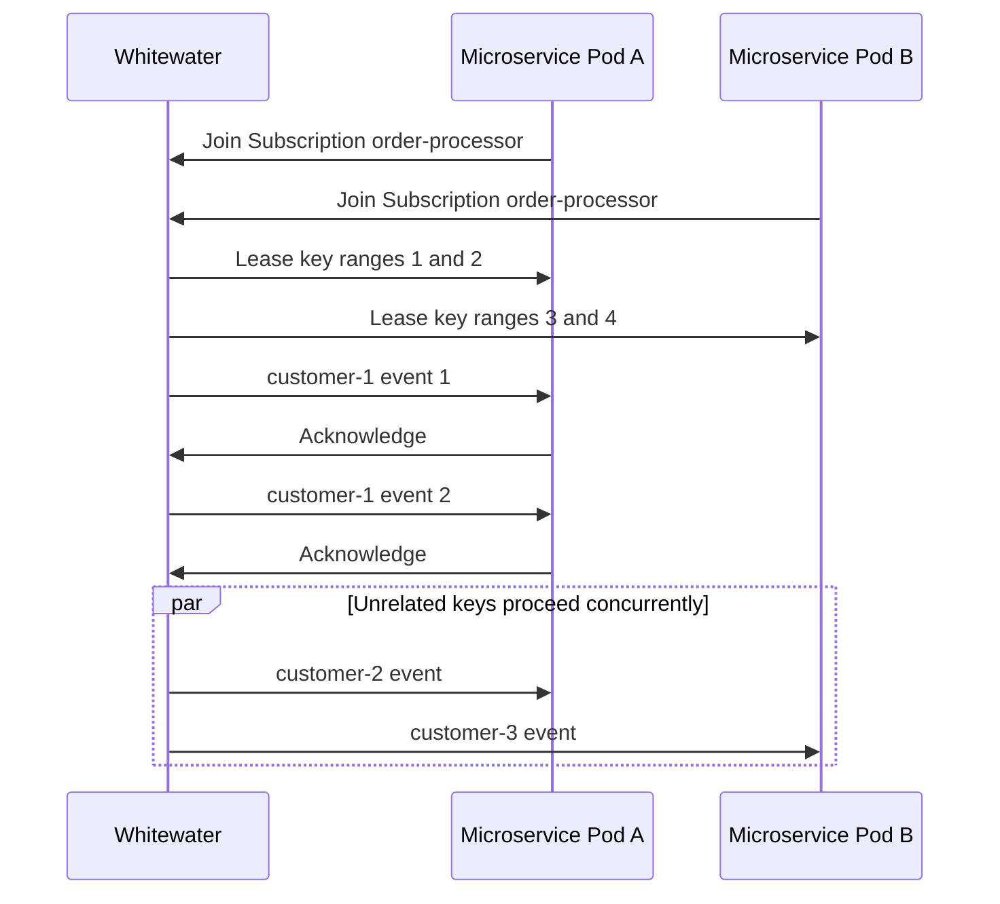
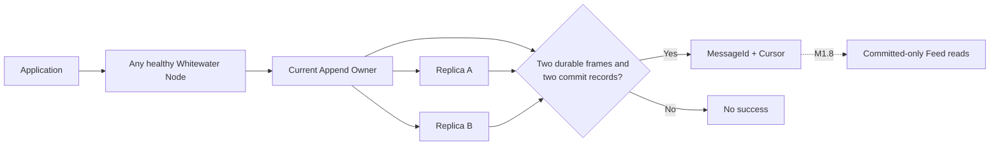

# Whitewater Sequence Diagrams

> A visual guide to current and planned Whitewater behavior. Each section states whether the flow is implemented or planned.

## Status legend

- **Implemented:** available in the current three-Node prototype.
- **Next:** the current implementation milestone.
- **Planned:** architecture direction, not current behavior.

## Append through any Node

**Status: Implemented through M1.7.**

The application sends only Feed, Key, payload, Metadata, event time, and stable Writer/request identity. Physical topology remains internal.

The owner and at least one follower must hold both the exact frame and durable commit evidence before success.

## Append directly through the owner

**Status: Implemented.**

There is no forwarding step when the ingress Node is already the owner.

## Retry through another Node

**Status: Implemented.**

The client must preserve request ID, Writer session ID, Writer epoch, sequence, event time, key, payload, and Metadata when retrying an ambiguous result.

## No majority available

**Status: Implemented and integration tested.**

Whitewater does not weaken durability settings to keep accepting writes.

## Committed-only application read

**Status: Implemented through M1.8.**

The replicated Feed path is exposed at `GET /v1/feeds/records`. The legacy `/v1/records` API remains separate during prototype migration.

## Why uncommitted frames remain hidden

**Status: Storage rule implemented; public Feed read path is M1.8.**

A replica may physically contain an uncommitted tail. Physical presence is not permission to return a record.

## Ownership transfer and stale-owner fencing

**Status: Manual transfer and epoch fencing implemented; automatic failure recovery is M1.9.**

Only a Control Plane committed transition may increase the ownership epoch.

## Future shared Subscription readers

**Status: Planned — Reader sessions are M3; durable Subscription leases are M7.**

One Subscription shares work among its Reader instances. One key remains in one ordered processing lane at a time; unrelated keys can run concurrently.

## Current system summary

| Capability | Status |
|---|---|
| Create Feed without partitions | Implemented |
| Append through any Node | Implemented |
| Exact-frame RF3 replication | Implemented |
| Two-of-three majority commit | Implemented |
| Cross-Node idempotent retry | Implemented |
| Committed-only application Feed reads | Implemented |
| Automatic owner failure recovery | Planned: M1.9 |
| Replica catch-up and repair | Planned: M1.10 |
| Reader sessions | Planned: M3 |
| Shared durable Subscriptions | Planned: M7 |
